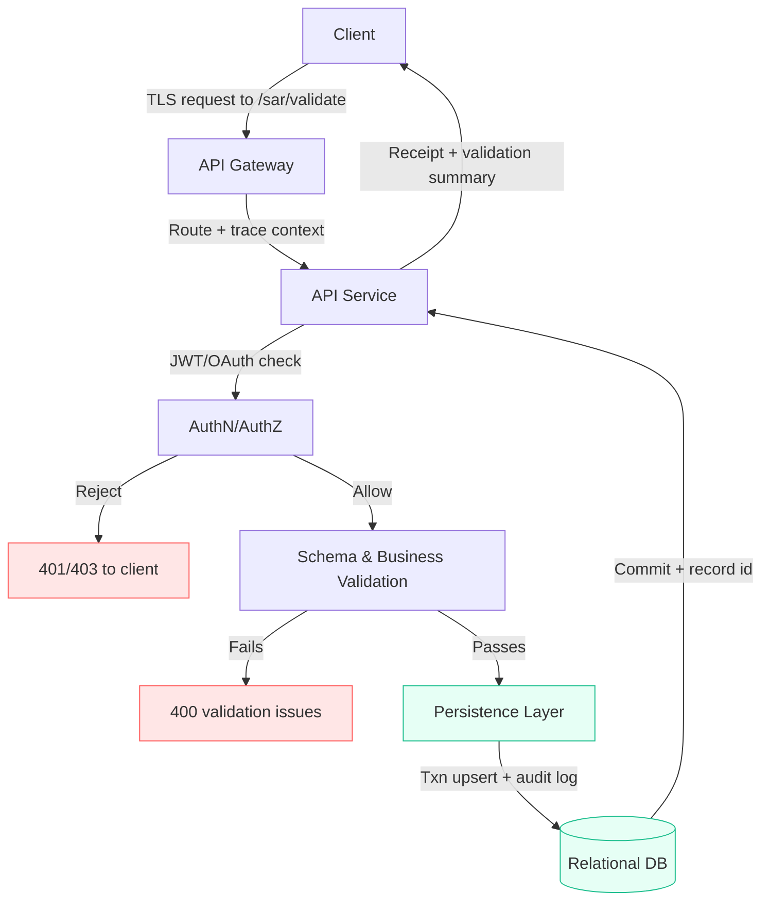

# stop-azs
This repository documents key allegations and participants in the alleged diversion of escrow funds
from the City National Bank trust account controlled by Justin E. Zeig. See [analysis.md](analysis.md)
for detailed background on the trust account activity, summaries of the shell entities involved,
captured case metadata, identified red flags, an expanded forensic ledger exhibit (as of 24 August
2025), and a concluding synthesis that ties the observed pass-through behavior to the ongoing
recovery and enforcement efforts.

## Windows NAS Bootstrap

The [windows-nas-bootstrap](windows-nas-bootstrap/) directory contains a Windows automation bundle that:
- Installs essential applications via winget (Python 3.12, Git, rclone, VS Code, 7-Zip, VLC, WinSCP, PuTTY)
- Maps NAS cloud storage drives (G:, I:, O:)
- Performs optional network speed tests

See [windows-nas-bootstrap/README.md](windows-nas-bootstrap/README.md) for usage instructions.

## External Research Resources

Investigators occasionally stage AI-assisted narratives or drafting notes outside the repository before
promoting them into `analysis.md`. A living index of those destinations now lives in
[`docs/external_resources.md`](docs/external_resources.md). Each entry records the location, primary
custodian, and handling expectations so contributors know how to access the Gemini workspace and any future
off-repo staging areas without breaking the evidence trail.

## Testing

Run `pytest` from the repository root to execute the lightweight validation checks in `tests/`.

## Request Flow

The repository assumes a structured request pipeline for submitting SAR data to an HTTP endpoint and storing
the results in a relational database. The diagrams below document the full path from the client request to
persisted records so contributors know where to attach validation, logging, and auditing hooks.

### High-level system path



```mermaid
sequenceDiagram
    autonumber
    participant C as Client
    participant G as API Gateway (TLS + routing)
    participant API as API Service (/sar/validate)
    participant Auth as AuthN/AuthZ
    participant V as Schema & Business Validator
    participant P as Persistence Layer
    participant DB as Relational Database

    C->>G: POST SAR payload (XML/JSON) over TLS
    G->>API: Forward request with trace context
    API->>Auth: Verify token/permissions
    Auth-->>API: Allow or reject
    alt Unauthorized
        API-->>C: 401/403 + error message
    else Authorized
        API->>V: Normalise + validate structure & rules
        V-->>API: ValidationResult (errors + normalised fields)
        alt Invalid payload
            API-->>C: 400 Bad Request + validation issues
        else Valid payload
            API->>P: Invoke domain logic with validated payload
            P->>DB: Begin txn; upsert SAR + findings; record audit log
            DB-->>P: Commit confirmation
            P-->>API: Persistence receipt
            API-->>C: 200 OK + validation summary & record id
        end
    end
```

**Stage overview**

1. **Ingress & Routing** – Clients post SAR data to `/sar/validate` over HTTPS, passing through the gateway
   so TLS termination and request tracing are applied consistently.
2. **Authentication & Authorization** – The API layer verifies identity (e.g., JWT/OAuth token) and confirms
   the caller is permitted to submit SARs before any validation or persistence occurs.
3. **Validation** – Incoming payloads are normalised and checked for mandatory sections, placeholders, and
   basic business rules; failures short-circuit with a detailed list of issues the caller can remediate.
4. **Persistence** – Valid submissions invoke domain logic that upserts the SAR, stores validation findings,
   and writes audit metadata inside a database transaction to keep request and compliance logs consistent.
5. **Response & Observability** – The API returns a receipt (record ID + validation summary) and captures
   metrics/logs so investigators can trace each submission from ingress to durable storage.
