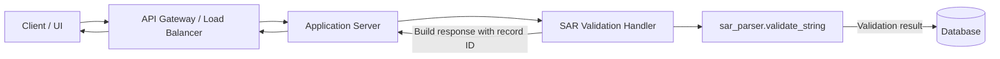

# Request Flow from Client Endpoint to Database

This document explains how a client request moves through the system, from the initial HTTP call to the point where data is persisted in the database. It focuses on the SAR validation workflow implemented in the `sar_parser` package.

## High-level steps

1. **Client submission** – A client sends a `POST /sar/validate` request containing SAR XML.
2. **Edge handling** – The request first passes through the API gateway or load balancer, which terminates TLS, enforces rate limits, and forwards the payload to the application tier.
3. **Application routing** – The application server routes the call to the SAR validation controller/handler responsible for orchestrating the request lifecycle.
4. **Validation service** – The handler invokes `sar_parser.validate_string` (or `validate_file` for file uploads) to perform structural checks, placeholder detection, and required block verification.
5. **Result persistence** – The validation result (status plus error list) is written to the database alongside request metadata (timestamp, client ID, correlation ID) so downstream analytics and auditing can retrieve it.
6. **Response construction** – The application constructs a JSON response summarizing validation status, detected errors, and the identifier of the stored record.
7. **Client delivery** – The response is returned to the client through the gateway, with logs and metrics emitted for observability.

## Mermaid flow

## Data persisted per request

- **Record identifier**: Unique ID generated per validation attempt.
- **Client and correlation IDs**: Values from headers used for traceability.
- **Validation status**: Boolean flag mirroring `ValidationResult.is_valid`.
- **Error list**: Serialized collection of `ValidationError` entries (message, location, severity).
- **Submission metadata**: Timestamp, request size, and endpoint version for auditing and analytics.

## Notes on error handling

- Malformed XML short-circuits to an error response with a 400 status while still recording the failure.
- Placeholder values in required fields are treated as validation errors and persisted for review.
- Database writes are wrapped in a transaction; failures emit alerts and return a 503 to the client without losing the validation result in memory.
