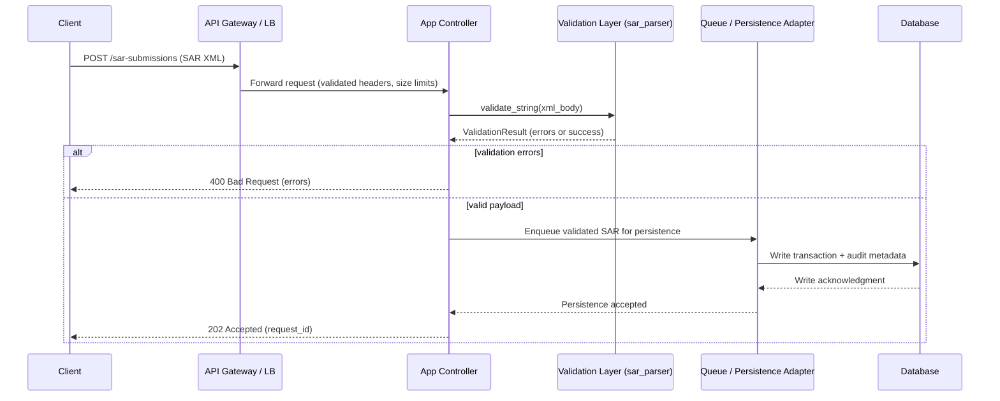

# Request Flow: Client Endpoint to Database

This document describes the end-to-end path a Suspicious Activity Report (SAR)
submission takes from the public client endpoint through validation and
persistence. It captures the critical components that must run in sequence to
ensure malformed data never reaches storage and clear errors are returned to
callers.

## Narrative flow

1. **Client submits XML payload** to the SAR submission endpoint over HTTPS.
2. **API gateway / load balancer** performs TLS termination, basic request size
   limits, and routes traffic to the application service.
3. **Application controller** reads the request body and hands the raw XML to
   the validation layer.
4. **Validation layer** invokes `sar_parser.validate_string`, which parses and
   enforces structural checks (required blocks, dates, amounts, UETR format).
5. **Error handling** immediately returns a 4xx response that lists validation
   errors if any checks fail.
6. **Persistence layer** is engaged only for valid payloads: the sanitized XML
   (or its structured representation) is queued for durable storage.
7. **Database write** records the transaction in the SAR datastore with
   auditing/observability metadata (request ID, user ID, timestamps).
8. **Response** confirms acceptance, echoing the request ID so clients can query
   status later.

## Mermaid sequence diagram

## Operational notes

- The validation layer should remain lightweight and dependency-free to keep
  request handling responsive.
- Queueing before database writes allows retries and back-pressure handling
  without slowing down the client response path.
- Audit metadata should travel alongside the payload to support investigations
  and traceability.
