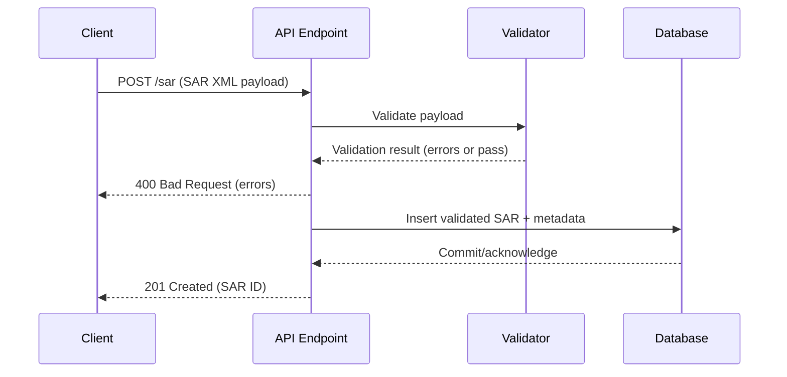

# SAR Ingestion Request Flow

This document explains how a Suspicious Activity Report (SAR) submission moves through the system, from the client-facing endpoint to persistence in a backing data store.

## Narrative overview

1. **Client submission**: A client (UI or machine-to-machine caller) submits an XML payload that conforms to the FinCEN SAR schema to the ingestion endpoint (for example, `POST /sar`).
2. **Transport handling**: The API layer terminates the HTTP request, applies authentication/authorization, and enforces content-type and size limits before reading the body into memory.
3. **Validation**: The payload is validated for schema and business rules (required sections, numeric amounts, dates, and UETR values). Any issues are collected into a structured result.
4. **Decision point**: If validation errors are present, the API returns a `400 Bad Request` with the collected messages so the client can correct the filing. If the document is valid, execution proceeds.
5. **Persistence**: The validated SAR document (and optional derived metadata) is written to the database through the persistence layer. Typical steps include opening a database transaction, inserting the normalized SAR data into domain tables, and committing the transaction. Failures during this step should be surfaced as `5xx` responses and logged for diagnostics.
6. **Response**: On success, the API returns a `201 Created` (or similar) response containing a stable identifier for the stored SAR record.

## Mermaid sequence diagram

## Implementation touchpoints

* Validation occurs inside the API layer using its validation utilities. Ensure the validator returns structured errors and a boolean indicator so the API can translate results into user-facing responses.
* Only proceed to database writes after validation succeeds. Keep persistence concerns isolated so that validation changes do not affect database logic.
