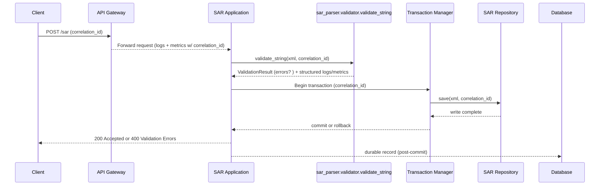

# SAR submission request flow

This document traces an inbound SAR payload from the client endpoint through
validation and transactional storage. Each hop emits structured logs and
metrics keyed by the correlation ID so investigators can trace a submission
through the gateway, application, validation, and database layers.

## Sequence overview

## Stage-by-stage notes

1. **Gateway (ingress):** Adds or preserves the ``correlation_id`` header and
   emits request logs and timing metrics.
2. **Application:** Calls :func:`sar_parser.validator.validate_string`, logging the
   correlation ID and validation start event.
3. **Validation:** The validator records structured events for parse failures,
   schema issues, or successful validation.
4. **Transactional storage:** :class:`sar_parser.pipeline.SARProcessor`
   wraps repository writes in an explicit transaction so downstream consumers
   never observe partial SAR submissions. Rollbacks emit error logs and failure
   metrics with the same correlation ID, including when commits fail after the
   payload has been written.
5. **Response:** The application responds only after the transaction commits or
   validation errors are returned.

## Logging and metrics expectations

- Every log entry and metric includes the ``correlation_id``. This allows a
  single SAR submission to be traced end-to-end across the service boundary,
  validation layer, and database commits.
- Validation produces the following metric names to simplify dashboards:
  - ``sar.validation.started``
  - ``sar.validation.failed`` (labeled with ``reason`` when available)
  - ``sar.validation.passed``
- Storage activity produces complementary metrics:
  - ``sar.storage.transaction_started``
  - ``sar.storage.saved``
  - ``sar.storage.transaction_committed``
  - ``sar.storage.failed``
- The gateway and application stages bookend the flow with:
  - ``sar.request.received``
  - ``sar.request.validated``
  - ``sar.request.rejected``
  - ``sar.request.completed``

Implementations can route structured logs to centralized observability tooling
while exporting metrics to Prometheus, StatsD, or a similar backend.
