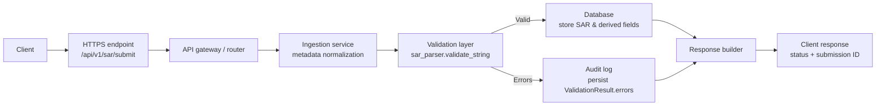

# Request Flow: Client Endpoint to Database

This document maps the end-to-end flow for a SAR submission request handled by an API layer that wraps the `sar_parser` validator. It covers how the request enters the system, the validation work done in `sar_parser`, and how data and errors are persisted.

## Step-by-step narrative
1. **Client request** – A client sends an HTTPS POST to the public ingestion endpoint (for example, `/api/v1/sar/submit`) containing the SAR XML payload and any metadata such as source system, submitter ID, and correlation IDs.
2. **Gateway and routing** – An API gateway or load balancer performs TLS termination, basic request validation (size limits, authentication/authorization), and forwards traffic to the SAR ingestion service.
3. **Request handling** – The ingestion service normalizes headers and metadata, enforces schema requirements on the envelope, and hands the XML body to the validation layer.
4. **Validation** – The service calls `sar_parser.validate_string` (or `validate_file` when reading from disk) to parse the XML, confirm the `<SAR>` root, ensure required blocks (filer information, subjects, transactions) exist, and flag placeholder values like `UNKNOWN` in critical fields such as `Amount`.
5. **Persistence** –
   - On success, the normalized payload is written to the primary database, and derived fields (submission timestamps, submitter identity, validation checksum) are stored alongside it.
   - On validation failure, the raw submission and structured error list from `ValidationResult.errors` are stored in an audit table so investigators can review the rejection reasons.
6. **Response** – The API returns a structured JSON response containing the submission ID, validation status, and any errors surfaced by `sar_parser` so the client can remediate issues or continue downstream processing.

## Mermaid diagram

