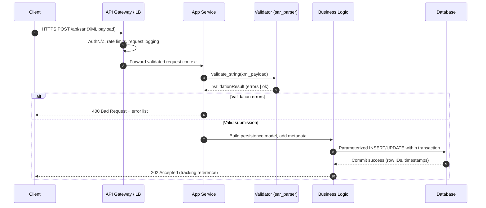

# Request Flow: Client Endpoint to Database

This document describes how a client request is processed from the public endpoint through validation and persistence. The flow is framed around the SAR validation utilities contained in `sar_parser`, showing where the validator participates before data is stored.

## Textual Overview
1. **Client submits data** to the public API endpoint (e.g., `POST /api/sar`).
2. **API Gateway / Load Balancer** authenticates the caller, enforces TLS, and forwards the request to the application service.
3. **Application Service** parses the payload and routes SAR submissions to the validation stage.
4. **Validation Layer (`sar_parser.validator`)** runs structural and semantic checks, returning a `ValidationResult` with actionable errors if issues are found.
5. **Business Logic** transforms validated SAR data into persistence models and enriches metadata (timestamps, request IDs, user context).
6. **Database Layer** executes parameterized inserts/updates within a transaction and emits audit logs for downstream monitoring.

## Mermaid Sequence Diagram

## Operational Notes
- **Authentication and rate limiting** should live in the gateway to protect the application from abusive traffic.
- **Validation failures** should return descriptive messages sourced from `ValidationResult.errors` to help clients correct submissions.
- **Database interactions** must use prepared statements and transactions to prevent injection and ensure atomic writes.
- **Audit logging** is recommended at the gateway, application, and database layers to support forensic review.
