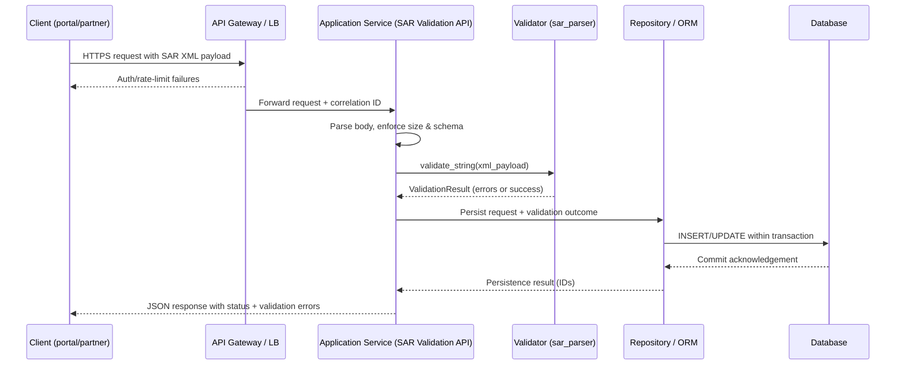

# Request Flow: Client Endpoint to Database

This document outlines how a SAR validation request travels from the public-facing endpoint to persistent storage. The flow assumes the application exposes an authenticated API endpoint that accepts SAR XML payloads and relies on the `sar_parser` utilities to validate documents before committing any data to the database.

## End-to-end flow
1. **Client submission** – A client (internal portal, partner integration, or automation) issues an HTTPS request to the SAR validation endpoint with the XML payload and authentication headers.
2. **Edge controls** – An API gateway or load balancer terminates TLS, enforces rate limits, performs authentication/authorization, and forwards the request to the application service with correlation identifiers attached.
3. **Request parsing** – The application server parses headers and body, validates request shape (content type, size limits), and creates an audit log entry seeded with the correlation ID.
4. **Domain validation** – The service invokes `sar_parser.validate_string` to confirm that the payload is well-formed SAR XML and that required blocks (filer information, subjects, transactions) and transaction amounts are present.
5. **Persistence** – The application creates a persistence command containing the request metadata, validation outcome, and any extracted fields and sends it to the repository/ORM. The repository writes data inside a database transaction to guarantee atomicity.
6. **Response construction** – The service formats a JSON response that includes validation status, any validation errors, and identifiers for the stored record, then returns it to the client. Observability hooks (metrics, structured logs, and trace spans) capture timing and outcomes at each hop.

## Mermaid sequence diagram

## Implementation notes
- The `sar_parser.validate_string` entry point performs structural checks, confirming that the payload is XML, the root element is `<SAR>`, and that filer information, subjects, transactions, and transaction amounts are present. Additional placeholder checks reject empty or placeholder amounts before data is stored.
- Any data writes should be wrapped in explicit transactions so downstream consumers never observe partially processed SAR submissions.
- Each stage should emit structured logs and metrics keyed by the correlation ID to make it easy to trace a single request across the gateway, application, validation, and database layers.
