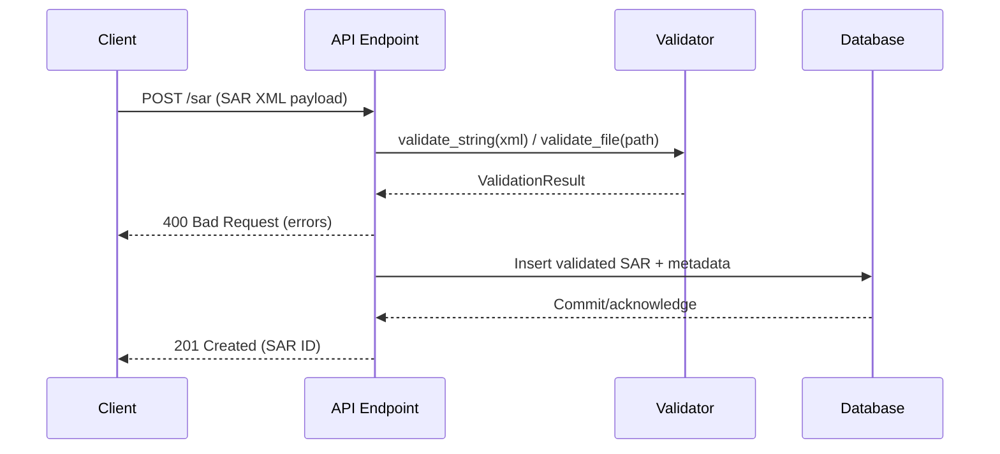

# SAR Ingestion Request Flow

This document explains how a Suspicious Activity Report (SAR) submission moves through the system, from the client-facing endpoint to persistence in a backing data store. It is anchored in the current validator utilities implemented in `sar_parser/validator.py` and adds the downstream persistence step for completeness.

## Narrative overview

1. **Client submission**: A client (UI or machine-to-machine caller) submits an XML payload that conforms to the FinCEN SAR schema to the ingestion endpoint (for example, `POST /sar`).
2. **Transport handling**: The API layer terminates the HTTP request, applies authentication/authorization, and enforces content-type and size limits before reading the body into memory.
3. **Validation**: The payload is passed to the validator entry point:
   * `validate_string` for in-memory XML payloads.
   * `validate_file` when the payload is first staged on disk.
   The validator parses the XML, checks for required sections, validates amounts (including finite numeric checks), dates, and UETR values, and produces a `ValidationResult` describing any issues.
4. **Decision point**: If the validation result contains errors, the API returns a `400 Bad Request` with the collected messages so the client can correct the filing. If the document is valid, execution proceeds.
5. **Persistence**: The validated SAR document (and optional derived metadata) is written to the database through the persistence layer. Typical steps include opening a database transaction, inserting the normalized SAR data into domain tables, and committing the transaction. Failures during this step should be surfaced as `5xx` responses and logged for diagnostics.
6. **Response**: On success, the API returns a `201 Created` (or similar) response containing a stable identifier for the stored SAR record.

## Mermaid sequence diagram

## Implementation touchpoints

* Validation logic is implemented in `sar_parser/validator.py`, primarily through `validate_string`, `validate_file`, and supporting helper checks for amounts, dates, and UETR values.
* The persistence layer and API transport handling are intentionally out of scope for the validator module; when integrating, ensure the API layer translates `ValidationResult` objects into user-facing responses and only proceeds to database writes after a clean validation pass.
