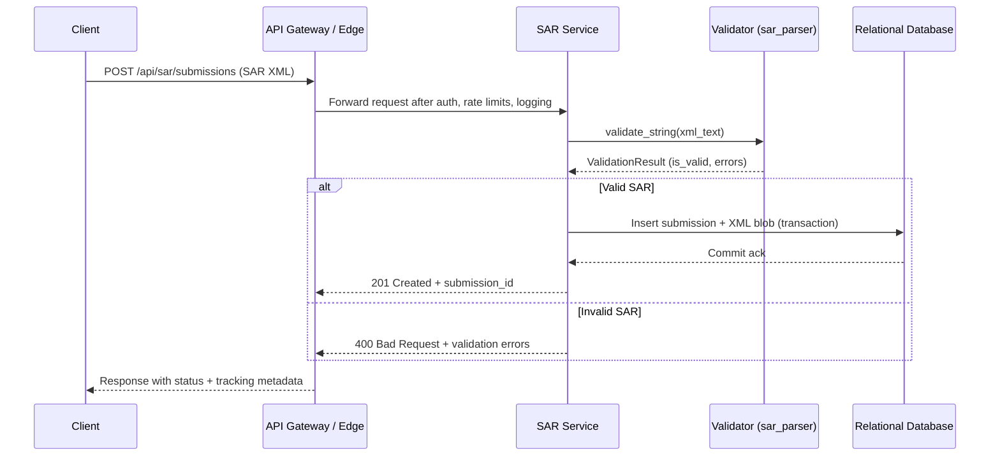

# SAR Submission Request Flow

This document describes how a Suspicious Activity Report (SAR) submission travels from the public HTTP endpoint to persistence in the relational database. The flow is designed around the existing `sar_parser` validator module and can be adapted to other storage backends if needed.

## End-to-end steps

1. **Client request** – An authenticated client POSTs a SAR XML payload to `POST /api/sar/submissions`, including metadata such as requester ID and optional filing tags.
2. **Edge handling** – The API layer terminates TLS, performs authentication/authorization, applies rate limits, and records structured access logs before passing the request body downstream.
3. **Payload parsing** – The application service reads the XML payload into memory and normalizes whitespace/newlines to keep line positions stable for error reporting.
4. **Validation** – The service invokes `sar_parser.validate_string(xml_text)` to parse and validate the document structure. The returned `ValidationResult` carries a boolean `is_valid` flag and a list of `ValidationError` entries that include message, location, and severity.
5. **Decision point**
   - **Invalid** – The service responds with HTTP 400 containing the collected validation errors so clients can correct and resubmit. Nothing is persisted.
   - **Valid** – The service derives a submission ID, normalizes key fields (e.g., filer name, transaction counts), and prepares a persistence payload.
6. **Persistence** – The application writes the normalized submission record and the original XML blob into the database (e.g., PostgreSQL) within a single transaction. Auditing columns capture who submitted the file and when validation occurred.
7. **Response** – The service returns HTTP 201 with the submission ID and a link for downstream tracking. Audit logs capture success/failure status for observability and future investigations.

## Mermaid sequence diagram

