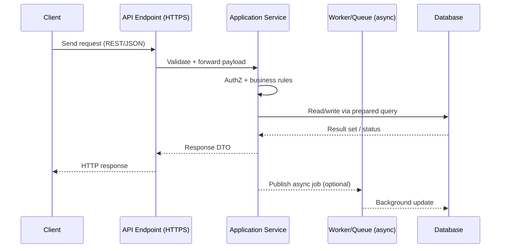

# CI Summary Handling and Request Flow

## CI post-step for `summary.json`
- Add a small post-step after the artifact is generated that uses `jq` to print a concise, human-readable summary into the workflow log.
- Example (GitHub Actions):
  ```yaml
  - name: Print run summary
    if: success() || failure()
    run: |
      if [ ! -f summary.json ]; then
        echo "summary.json not found; skipping." >&2
        exit 0
      fi
      echo "--- Run Summary ---"
      jq -r '
        if type == "array" then
          map("• " + (.title // .name // "item") + ": " + (.status // .state // "n/a")) | .[]
        elif type == "object" then
          [
            "• Title: " + (.title // .name // "n/a"),
            "• Status: " + (.status // .state // "n/a"),
            (.details // .summary // empty)
          ] | .[]
        else
          "• Unrecognized summary.json shape"
        end
      ' summary.json
  ```
- This keeps the job log consumable without changing existing artifacts and works even if the job ultimately fails.

## Sharing `summary.json` to Slack or Teams
- Slack: upload the file with `files.upload` (for the raw JSON) and pair it with a short message thread for context; store the bot token in repo secrets.
- Teams: publish the file in a build artifact and post a connector card (or Adaptive Card) link to that artifact; tokens/webhooks also live in secrets.
- Keep the push optional behind a boolean input (e.g., `send_summary_artifact`) so routine runs do not spam channels.

## Request flow from client endpoint to database
- Incoming request hits the public API endpoint (HTTPS) and passes through authn/z plus validation.
- The application layer parses the payload, applies business rules, and decides whether to read or write data.
- Database access uses parameterized queries/ORM calls; responses are normalized before being returned to the client.
- Background workers may update the database asynchronously for slow or side-effect-heavy tasks.


