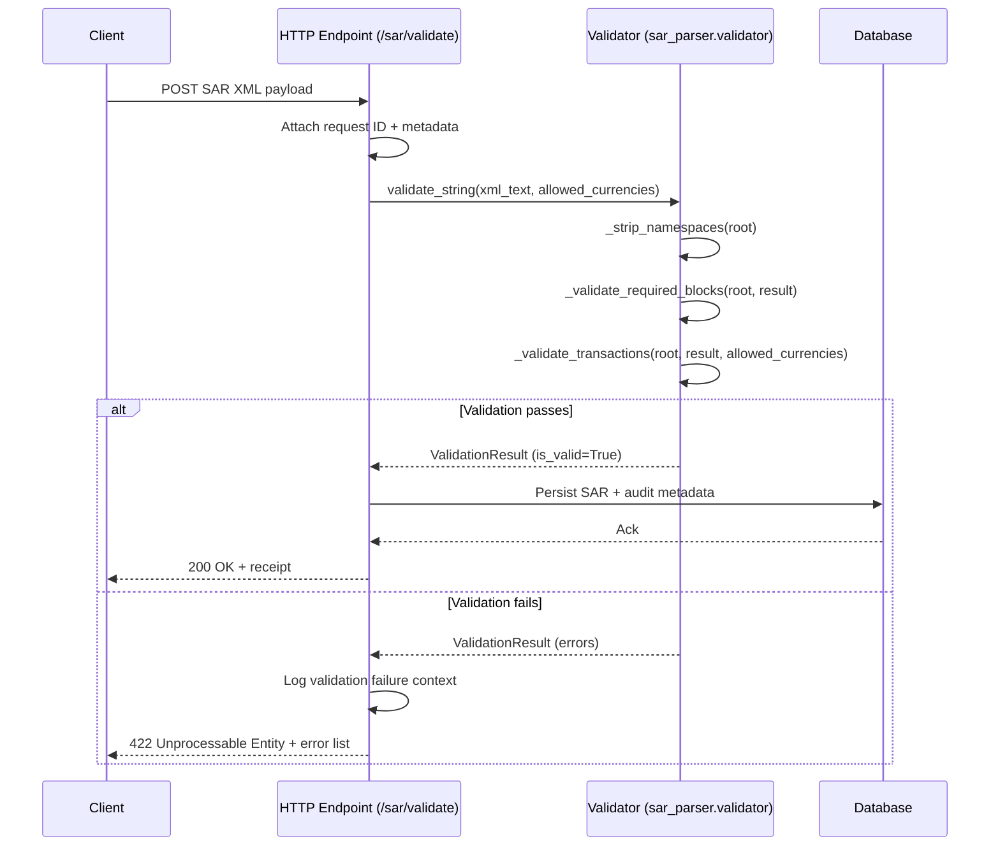

# Request Flow: Client Endpoint to Database

This document outlines how a SAR validation API processes inbound requests end-to-end, using the existing `sar_parser.validator` utilities for XML inspection before persisting results. The flow assumes the HTTP layer authenticates callers and attaches request metadata so the validator can focus solely on structure and currency validation.

## Narrative Flow
1. **Client submission** – An external client POSTs a SAR XML payload to the validation endpoint (e.g., `/sar/validate`) together with a request identifier and optional currency allowlist extensions.
2. **Request handling** – The HTTP handler reads the raw XML text from the body, attaches contextual metadata (request ID, client identifier, received timestamp), and passes the XML string plus `allowed_currencies` to `validate_string` for validation.
3. **Namespace normalization** – `validate_string` calls `_strip_namespaces` to remove default or prefixed XML namespaces so element lookups are deterministic.
4. **Structural checks** – `_validate_required_blocks` ensures required top-level sections (such as `<FilerInformation>`, `<Subject>`, and `<Transaction>`) exist before deeper inspection.
5. **Transaction checks** – `_validate_transactions` walks each `<Transaction>` to verify amounts are present, not placeholders, and carry a valid three-letter currency code (using the default allowlist plus any custom additions supplied by the endpoint).
6. **Result construction** – The accumulated `ValidationResult` is returned to the handler. If `is_valid` is `True`, the payload is considered ready for persistence.
7. **Database persistence** – Valid documents are written to the storage layer (e.g., a relational database) alongside the captured metadata and a validation receipt. Invalid documents skip persistence but still return structured errors to the caller and can optionally be logged for support triage.

## Mermaid Sequence Diagram

## Integration Notes
- The database layer is intentionally decoupled from the validator; call sites should persist only after receiving a clean `ValidationResult`.
- Custom currency allowlists can be passed through the endpoint to support edge cases without relaxing the core validation behavior.
- Any upstream middleware (rate limiting, auth) should wrap the endpoint before the validation call, since the validator assumes already-trusted input streams.
- Capture and persist the request identifier alongside the SAR payload to correlate downstream storage entries with upstream client requests.
